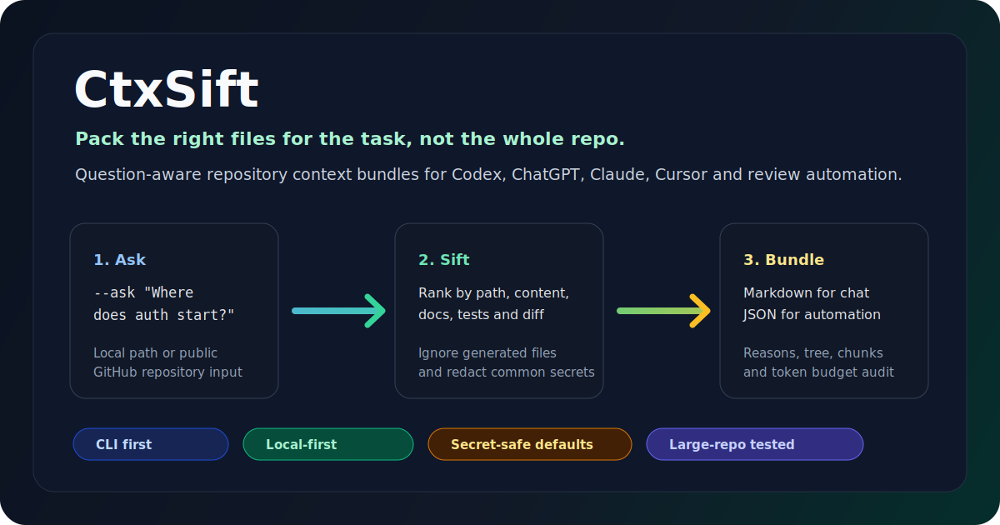

<div align="center">

# CtxSift



**按问题和 diff 选择代码上下文，默认脱敏**

*一个本地运行的代码库上下文打包工具。*

<br />

[](https://github.com/HF-CYGG/CtxSift/releases/tag/v1.3.0-alpha.0)
[](https://github.com/HF-CYGG/CtxSift/actions)
[]()
[]()
[](LICENSE)

</div>

<br />

CtxSift 是一个本地优先的代码库上下文打包 CLI。它读取本地仓库或公开 GitHub 仓库，根据问题、diff、workspace package、路径、文档、测试和入口文件对候选文件排序，输出 Markdown 或 JSON bundle。默认会跳过或脱敏常见敏感内容；核心流程不调用 LLM，也不上传私有源码。

---

## 核心能力

CtxSift 不做全仓文本导出。它的重点是为一次问题或一次 PR 变更选择合适的文件，并解释为什么选中它们。

| 能力 | 说明 |
| :--- | :--- |
| 问题相关 | 根据 `--ask`、路径、内容、文档、测试和入口文件排序。 |
| 可解释 | 每个入选文件带有分数和选择理由，便于审计。 |
| 预算控制 | 按 `--max-tokens` 裁剪输出，超大文件会被截断。 |
| Monorepo 支持 | 解析 pnpm / `package.json` workspaces，记录内部依赖和 focused packages。 |
| PR 评审上下文 | 使用 `--diff` 和 `--mode review` 生成 changed files、相关测试、风险提示和选中文件。 |
| 安全配置 | 默认脱敏；`private` / `strict` 会阻止高风险文件正文输出。 |
| 本地执行 | 不调用 LLM、不上传源码、不依赖向量数据库。 |

---

## 快速开始

```bash
# 全局安装
npm install -g ctxsift

# 在当前代码库中提出问题
ctxsift --repo . --ask "Where does auth start?"
```

<details>
<summary><b>从源码构建与运行</b></summary>

```bash
git clone https://github.com/HF-CYGG/CtxSift.git
cd CtxSift
pnpm install
pnpm build
node dist/cli.js --repo . --ask "Where does auth start?"
```

</details>

---

## 常用场景

### 01. 为一次问题准备上下文
生成 Markdown bundle，交给代码助手或评审者阅读。
```bash
ctxsift --repo . \
  --ask "How does user authentication and route guarding work?" \
  --format markdown \
  --out auth-context.md
```

### 02. 输出结构化 JSON
生成机器可读的 JSON bundle，供脚本、编辑器插件或 CI 流程消费。
```bash
ctxsift --repo . \
  --ask "How does routing work?" \
  --format json \
  --out ctxbundle.json
```

### 03. 为 PR 生成 review context
根据 diff 收集 changed files、相关测试、相关文档和风险提示。
```bash
ctxsift --repo . \
  --diff main...HEAD \
  --mode review \
  --format markdown \
  --out review-context.md
```

<details>
<summary><b>04. 接入 GitHub Actions</b></summary>

```yaml
permissions:
  contents: read

steps:
  - uses: actions/checkout@v4
    with:
      fetch-depth: 0
  - uses: HF-CYGG/CtxSift@master
    with:
      profile: private
```
*默认只上传 artifact。开启 sticky comment 需要 `pull-requests: write` 权限，详见 [GitHub Action](docs/github-action.md)。*

</details>

<details>
<summary><b>05. 分析公开仓库</b></summary>

```bash
ctxsift --repo https://github.com/user/repo \
  --ask "Where is request routing implemented?" \
  --format json
```

</details>

---

## CLI 参数

| 参数 | 说明 |
| :--- | :--- |
| `--repo <path-or-url>` | 本地仓库路径或公开 GitHub 仓库 URL。 |
| `--ask <question>` | 当前任务问题；排序器会围绕它选择文件。 |
| `--diff <base...head>` | 生成 diff-aware review bundle。 |
| `--workspace-aware` | 显式启用 workspace/package graph 分析。 |
| `--workspace-graph` | 只输出 workspace graph，可不传 `--ask` 或 `--diff`。 |
| `--package <name-or-path>` | 将指定 workspace package 作为重点，例如 `apps/web` 或 `@scope/web`。 |
| `--profile <level>` | 安全策略：`balanced` 默认，另有 `private`、`strict`。 |
| `--mode <type>` | 工作模式：`question`、`review`、`diff`、`onboarding`、`bugfix`。 |
| `--max-tokens <num>` | 输出 token 预算，默认 `20000`。 |
| `--format <type>` | 输出 `markdown` 或 `json`。 |
| `--out <file>` | 写入文件；不传则输出到 stdout。 |
| `--include/exclude` | 强制包含或排除特定路径，支持 glob。 |
| `--no-redact` | 关闭内容脱敏，并向 stderr 输出警告。 |

---

## 安全默认值

默认情况下，CtxSift 会排除或脱敏以下内容：
- `.env` / `.env.*` 配置文件
- 证书、私钥 (`*.pem`, `*.key`)
- 云服务密钥，如 AWS、OpenAI、GitHub token
- JWT、数据库连接串及硬编码凭证
- 构建产物、覆盖率报告及二进制大文件

> 使用 `--no-redact` 时，CtxSift 会继续运行并打印警告。不要把未脱敏 bundle 发布到公开环境。

---

## 性能和基准

以下是现有压力测试结果。耗时会受机器、磁盘和仓库状态影响。

| 目标代码库 | 项目类型 | 规模 (文件数) | 耗时 |
| :--- | :--- | :--- | :--- |
| **Y-Link** | Vue / Node 业务中台 | 37,289 | ~1.0s |
| **VSCode** | TypeScript / Electron | 16,336 | ~8.0s |
| **Kubernetes** | Go 云原生控制平面 | 30,594 | ~12.0s |
| **Django** | Python Web 框架 | 7,100 | ~3.0s |
| **Spring** | Java / Kotlin 框架 | 11,417 | ~5.0s |

Fixture benchmark 使用 6 个本地样例，覆盖 simple TypeScript、pnpm monorepo、Turbo/Nx metadata、strict security profile 和 PR diff review bundle。完整结果见 [Benchmark 报告](benchmark-report.md) 和 [Benchmark 工具包](docs/benchmark.md)。

---

## 架构概览

主要处理流程：

```text
CLI 意图解析
 ├─ RepoLoader        (环境准备与规则合并)
 ├─ FileClassifier    (资产类型与敏感度识别)
 ├─ WorkspaceGraph    (Monorepo 依赖图谱构建)
 ├─ SecurityRedactor  (敏感内容脱敏)
 ├─ QuestionRanker    (多维度意图匹配与打分)
 ├─ TokenBudgeter     (token 预算截断)
 └─ BundleEmitter     (Markdown/JSON 输出)
```

---

## 本地开发

常用验证命令：

```bash
pnpm install
pnpm lint
pnpm typecheck
pnpm test
pnpm test:e2e
pnpm build
pnpm pack --dry-run
pnpm run release:check
```

## 文档
- [快速开始](docs/quickstart.md)
- [CLI 参考](docs/cli.md)
- [安全模型](docs/security.md)
- [Review Bundle](docs/review-bundle.md)
- [GitHub Action](docs/github-action.md)
- [Monorepo 选包指南](docs/monorepo.md)
- [Benchmark 工具包](docs/benchmark.md)
- [架构说明](docs/architecture.md)
- [v1.3.0-alpha.0 发布说明](docs/release-v1.3.0-alpha.0.md)
- [v1.2.0-alpha.0 发布说明](docs/release-v1.2.0-alpha.0.md)
- [v1.1.0-alpha.0 发布说明](docs/release-v1.1.0-alpha.0.md)
- [v1.0.0 发布说明](docs/release-v1.0.0.md)
