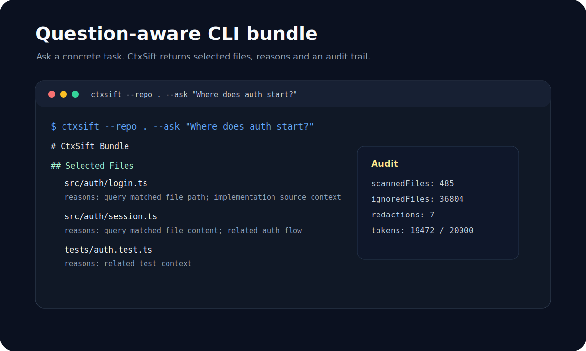
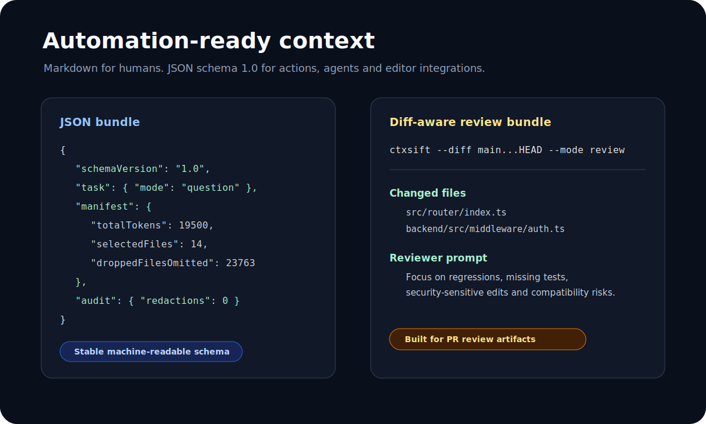

# CtxSift

<p align="center">
  
</p>

<p align="center">
  <a href="https://github.com/HF-CYGG/CtxSift/releases/tag/v1.0.0"></a>
  <a href="https://github.com/HF-CYGG/CtxSift/actions"></a>
  
  
  <a href="LICENSE"></a>
</p>

<p align="center">
  <strong>问题感知、monorepo selective、diff-aware 的上下文打包器。</strong>
  为任务打包真正相关的文件，而不是把整个仓库塞进上下文。
</p>

CtxSift 是一个本地优先的代码库上下文打包 CLI。它读取本地仓库或公开 GitHub 仓库，根据你的问题、workspace package、路径、文档、测试、入口文件和 diff 信息对候选文件排序，默认排除/脱敏敏感内容，并输出适合 Codex、ChatGPT、Claude、Cursor、Aider 和自动化评审流程使用的 Markdown 或 JSON 上下文包。

## 目录

- [为什么需要 CtxSift](#为什么需要-ctxsift)
- [预览](#预览)
- [快速开始](#快速开始)
- [常用场景](#常用场景)
- [输出格式](#输出格式)
- [安全默认值](#安全默认值)
- [大型仓库实测](#大型仓库实测)
- [架构](#架构)
- [项目状态](#项目状态)
- [本地开发](#本地开发)

## 为什么需要 CtxSift

传统 full-repo 打包器关注“导出所有文件”。CtxSift 关注“这次任务真正需要哪些文件”。

| 能力 | CtxSift 的做法 |
| --- | --- |
| 问题感知 | 围绕 `--ask` 的具体问题筛选文件，而不是全仓导出。 |
| 可解释 | 每个入选文件都会带上选择理由和分数组成。 |
| 可控预算 | 按 token 预算裁剪；超大高分文件会截断保留关键上下文。 |
| Monorepo selective | 识别 pnpm / `package.json` workspaces，将 diff 命中的 package 及其内部依赖纳入排序理由。 |
| 代码评审 | 支持 `--diff base...head --mode review` 生成评审上下文包。 |
| PR 工作流 | 提供 GitHub Actions 示例，可上传 review context artifact，并可选更新 sticky PR 摘要评论。 |
| 默认安全 | 忽略 `.env`、密钥、证书、产物、二进制和大文件，并进行基础脱敏。 |
| 本地优先 | 核心流程不调用 LLM、不上传私有代码、不依赖向量数据库。 |

## 预览

| 问题打包 CLI | JSON / Review Bundle |
| --- | --- |
|  |  |

## 快速开始

```bash
# npm 包可用时
npm install -g ctxsift

# 针对当前仓库提出问题
ctxsift --repo . --ask "Where does auth start?"
```

从源码运行：

```bash
git clone https://github.com/HF-CYGG/CtxSift.git
cd CtxSift
pnpm install
pnpm build
node dist/cli.js --repo . --ask "Where does auth start?"
```

## 常用场景

### 1. 为 AI 助手准备任务上下文

```bash
ctxsift --repo . \
  --ask "How does user authentication and route guarding work?" \
  --format markdown \
  --out auth-context.md
```

适合把 `auth-context.md` 直接交给 Codex、ChatGPT、Claude 或 Cursor，减少“先读全仓”的成本。

### 2. 输出机器可读 JSON

```bash
ctxsift --repo . \
  --ask "How does routing work?" \
  --format json \
  --out ctxbundle.json
```

JSON bundle 适合被 GitHub Action、编辑器插件、脚本或后续 MCP 适配器消费。

### 3. 生成 diff-aware 评审包

```bash
ctxsift --repo . \
  --diff main...HEAD \
  --mode review \
  --format markdown \
  --out review-context.md
```

Review bundle 会整理 changed files、相关测试、相关文档和风险提示，适合在 PR 评审前生成上下文。

### 4. 分析公开 GitHub 仓库

```bash
ctxsift --repo https://github.com/user/repo \
  --ask "Where is request routing implemented?" \
  --format json
```

## CLI 参数

| 参数 | 说明 |
| --- | --- |
| `--repo <path-or-url>` | 本地仓库路径或公开 GitHub 仓库 URL。 |
| `--ask <question>` | 当前任务/问题；排序器会围绕它选择文件。 |
| `--diff <base>...<head>` | 生成 diff-aware review bundle。 |
| `--workspace-aware` | 显式启用 workspace/package graph 感知；默认会在发现 workspace 配置时自动分析。 |
| `--workspace-graph` | 输出 workspace graph；不需要同时传 `--ask` 或 `--diff`。 |
| `--package <name-or-path>` | 将指定 workspace package 作为当前任务重点，例如 `apps/web` 或 `@scope/web`。 |
| `--mode <mode>` | 支持 `question`、`review`、`diff`、`onboarding`、`bugfix`。 |
| `--max-tokens <number>` | 输出 token 预算，默认 `20000`。 |
| `--format markdown|json` | 输出 Markdown 或 JSON。 |
| `--out <file>` | 写入文件；不传则输出到 stdout。 |
| `--include <glob[,glob]>` | 强制包含指定路径模式。 |
| `--exclude <glob[,glob]>` | 排除指定路径模式。 |
| `--no-redact` | 关闭内容脱敏，会向 stderr 打印警告。 |
| `--debug` | 保留调试开关，供后续扩展。 |
| `--version` | 输出版本号。 |
| `--help` | 输出帮助信息。 |

## 输出格式

Markdown 输出适合直接复制给 AI 助手：

```text
# CtxSift Bundle

## Task
Where does auth start?

## Selected Files
### src/auth/login.ts
- Reasons: query matched file path; implementation source context

## Audit
- Scanned files: 485
- Ignored files: 36804
- Redactions: 7
```

JSON 输出面向自动化工具，当前 schema 为 `1.0`，包含：

- `task`：问题、模式、目标模型等任务信息。
- `repo`：仓库来源、root、ref。
- `manifest`：token、选中文件数、丢弃文件、`droppedFilesOmitted`、redaction 数量。
- `tree`：候选文件树摘要。
- `selectedFiles`：文件路径、语言、分数、理由。
- `chunks`：实际输出内容。
- `workspaces`：可选 workspace graph，包含 package nodes、内部依赖边、focused packages 和 package-level reasons。
- `workspaces.buildTargets`：package scripts、Turbo/Nx 标记和 TypeScript project references 摘要。
- `workspaces.importEdges`：源码中指向内部 workspace package 的基础 import 边。
- `review`：diff-aware 模式下的 changed files、相关测试/文档、风险提示。
- `audit`：扫描、忽略、脱敏统计。

## 安全默认值

默认会排除或脱敏：

- `.env` / `.env.*`
- `*.pem`、`*.key`、证书和私钥文件
- OpenAI key、GitHub token、AWS access key / secret
- JWT / bearer token、`DATABASE_URL`
- 常见 `password` / `credential` 赋值
- `node_modules`、`dist`、`build`、coverage、二进制文件、大文件

如果使用 `--no-redact`，CtxSift 会继续运行，但会输出明确警告。不要把未脱敏 bundle 分享到公开环境。

## 大型仓库实测

CtxSift v1.0.0 已用多个真实复杂仓库做过压力测试，覆盖 TypeScript/Electron、Go 云原生、Python Web、Java/Kotlin/Gradle 和业务型 Vue/Node 项目。

| 仓库 | 类型 | 文件数 | 典型耗时 |
| --- | --- | ---: | ---: |
| Y-Link | Vue / Node / Express 业务系统 | 37,289 | 约 1 秒 |
| VSCode | TypeScript / Electron monorepo | 16,336 | 约 8 秒 |
| Kubernetes | Go 云原生控制平面 | 30,594 | 约 12 秒 |
| Django | Python Web 框架 | 7,100 | 约 3 秒 |
| Spring Framework | Java / Kotlin / Gradle 框架 | 11,417 | 约 5 秒 |

实测后做过的关键优化：

- 截断大型仓库的 `tree` 和 `droppedFiles` 元数据，单个 JSON bundle 从约 3.4 MB 降到约 130 KB。
- 只对最终输出文件执行内容脱敏，默认 redaction 场景耗时接近 `--no-redact` 对照场景。
- 对实现类问题优先保留 source 文件；首个高分超大文件会截断纳入 bundle。
- 保留 `droppedFilesOmitted`，避免为了减小输出而丢失审计信息。

## 架构

```text
CLI 参数
  -> PackRequest
  -> 准备本地/远程仓库
  -> 扫描候选文件
  -> 文件分类
  -> workspace graph 分析
  -> 安全过滤与内容脱敏
  -> 问题感知排序
  -> token 预算裁剪
  -> Markdown / JSON 输出
```

核心模块：

- `RepoLoader`：读取目录、合并 `.gitignore` 和内置忽略规则、统一 Windows/Unix 路径。
- `FileClassifier`：识别源码、测试、文档、配置、生成产物、二进制和敏感文件。
- `WorkspaceDetector` / `WorkspaceGraph`：识别 pnpm / `package.json` workspaces、内部依赖边、diff 命中的 focused packages 和包级选择理由。
- `QuestionRanker`：基于 query 命中、路径、内容、文档、测试关联、入口文件和 diff 信息打分。
- `TokenBudgeter`：估算 token；在超预算时裁剪低优先级文件或截断首个高分超大文件。
- `SecurityRedactor`：脱敏常见 secret，并输出审计计数。
- `BundleEmitter`：生成 Markdown 或 JSON bundle。
- `CliApp`：解析 CLI 参数、串联数据流、处理错误码。

## 项目状态

当前仓库已正式发布 `v1.0.0`。

- Release：[CtxSift v1.0.0](https://github.com/HF-CYGG/CtxSift/releases/tag/v1.0.0)
- CI：[GitHub Actions](https://github.com/HF-CYGG/CtxSift/actions)
- License：[MIT](LICENSE)

发布门禁：

```bash
pnpm run release:check
```

该命令覆盖 `lint`、`typecheck`、单元/集成测试、CLI E2E、build、pack dry-run 和 high-severity audit。

## 本地开发

```bash
pnpm install
pnpm lint
pnpm typecheck
pnpm test
pnpm test:e2e
pnpm build
pnpm pack --dry-run
pnpm run release:check
```

## 文档

- [快速开始](docs/quickstart.md)
- [CLI 参考](docs/cli.md)
- [安全模型](docs/security.md)
- [Review Bundle](docs/review-bundle.md)
- [Monorepo selective packing](docs/monorepo.md)
- [架构说明](docs/architecture.md)
- [v1.0.0 发布说明](docs/release-v1.0.0.md)
